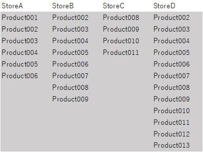
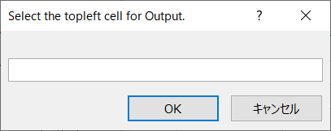
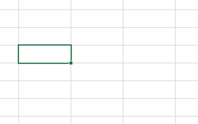
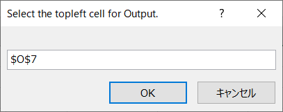
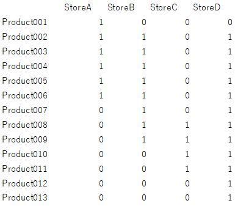

== checkExistOrNot.bas

. Select products of stores.

+

+ 
. The input dialog for the output ob result

+

+ 
. Select the cell for the output.

+

+ 
. Selection is in the text box.

+

+ 
. The result is output.

+

